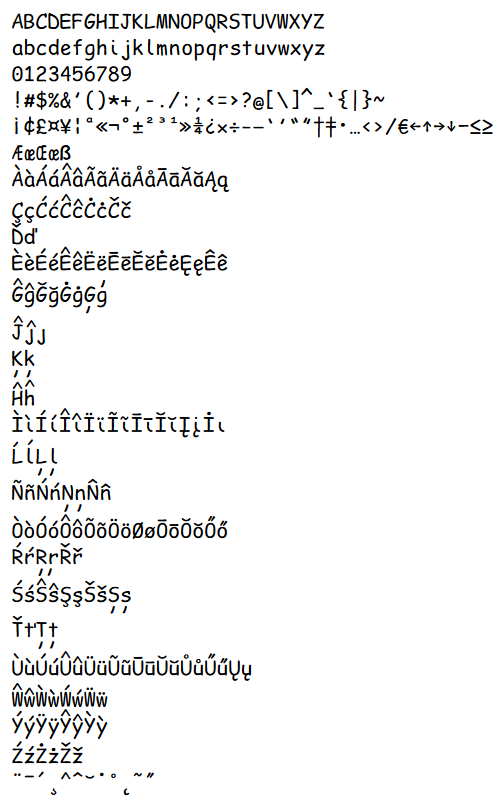

# Comic Recidivist Mono

Comic Recidivist Mono is a monospace font styled after Comic Sans. It's a heavily edited derivative of [Comic Shanns](https://github.com/shannpersand/comic-shanns) by Shannon Miwa that attempts to inject back in some of the original Comic Sans style (like a recidivist returning to sin).

I plan on updating the font with support for more unicode blocks at some point in the future, but right now it has support for all of the relevant ASCII and Latin Extended stuff.

More specifically, Comic Recidivist Mono supports the following characters:

```
ABCDEFGHIJKLMNOPQRSTUVWXYZ
abcdefghijklmnopqrstuvwxyz
0123456789
!#$%&'()*+,-./:;<=>?@[\]^_`{|}~
¡¢£¤¥¦ª«¬°±²³¹»¼¿×÷–—‘’“”†‡•…‹›⁄€←↑→↓−≤≥
Æ挜ß
ÀàÁáÂâÃãÄäÅåĀāĂ㥹
ÇçĆćĈĉĊċČč
Ďď
ÈèÉéÊêËëĒēĔĕĖėĘęĚě
ĜĝĞğĠġĢģ
Ĵĵȷ
Ķķ
Ĥĥ
ÌìÍíÎîÏïĨĩĪīĬĭĮįİı
ĹĺĻļ
ÑñŃńŅņŇň
ÒòÓóÔôÕõÖöØøŌōŎŏŐő
ŔŕŖŗŘř
ŚśŜŝŞşŠšȘș
ŤťȚț
ÙùÚúÛûÜüŨũŪūŬŭŮůŰűŲų
ŴŵẀẁẂẃẄẅ
ÝýŸÿŶŷỲỳ
ŹźŻżŽž
¨¯´¸ˆˇ˘˙˚˛˜˝
```


