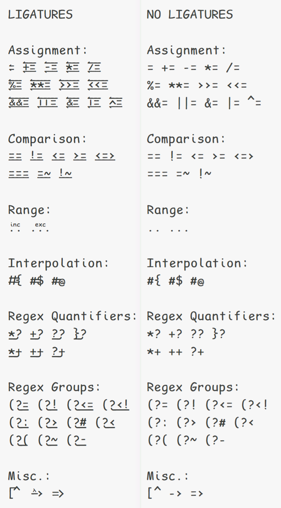

# Comic Recidivist Mono Ruby Ligatures

The following character sequences have ligatures in this set:
```
Assignment:
= += -= *= /=
%= **= >>= <<=
&&= ||= &= |= ^=

Comparison:
== != <= >= <=>
=== =~ !~

Range:
.. ...

Interpolation:
#{ #$ #@

Regex Quantifiers:
*? +? ?? }?
*+ ++ ?+

Regex Groups:
(?= (?! (?<= (?<!
(?: (?> (?# (?<
(?( (?~ (?-

Misc.:
[^ -> =>
```


